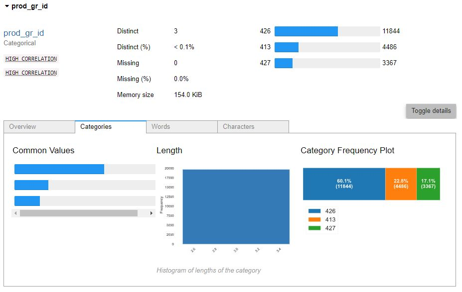
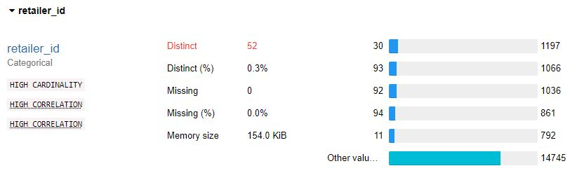
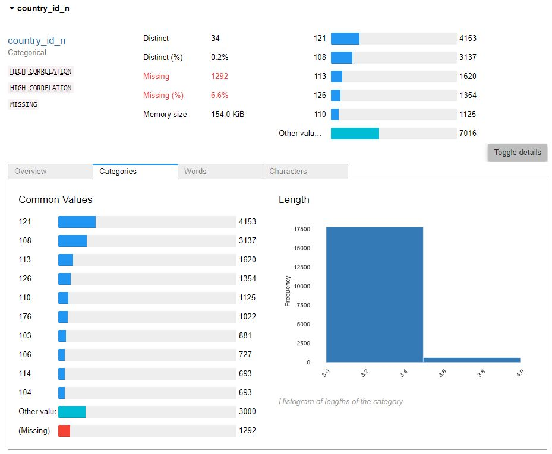
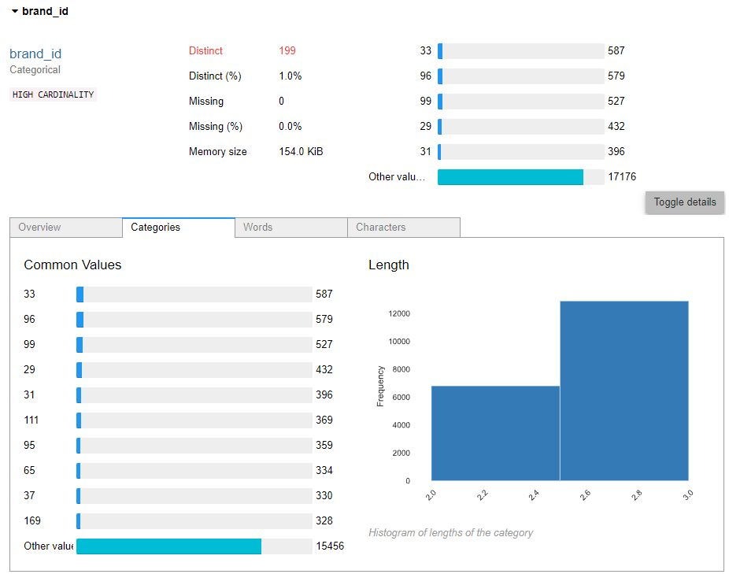

```
Folder PATH listing
├───config
├───docs
│   └───images
│       ├───metrics
│       └───pandas_profiler
├───input
├───logs
├───notebooks
├───output
│   ├───charts
│   │   ├───monthly_stability
│   │   │   ├───class_acctual
│   │   │   │   ├───brand_id
│   │   │   │   ├───country_id_n
│   │   │   │   ├───delivery_type_id
│   │   │   │   ├───prod_gr_id
│   │   │   │   └───retailer_id
│   │   │   └───predict_automatch
│   │   │       ├───brand_id
│   │   │       ├───country_id_n
│   │   │       ├───delivery_type_id
│   │   │       ├───freq_id
│   │   │       ├───if_data_corrected
│   │   │       ├───prod_gr_id
│   │   │       └───retailer_id
│   │   └───weekly_stability
│   │       ├───class_acctual
│   │       │   ├───brand_id
│   │       │   ├───country_id_n
│   │       │   ├───delivery_type_id
│   │       │   ├───prod_gr_id
│   │       │   └───retailer_id
│   │       └───predict_automatch
│   │           ├───brand_id
│   │           ├───country_id_n
│   │           ├───delivery_type_id
│   │           ├───prod_gr_id
│   │           └───retailer_id
│   └───reports
│       ├───classification_performance
│       ├───data_drift
│       └───target_drift
└───scripts
    └───python
```

# Measurement of served model bias

---

## Challenges and assumptions

**Explainability**
>
> Explainability should be taken into account during each stage of the ML lifecycle,
> for example, Problem Formation, Dataset Construction, Algorithm Selection,
> Model Training Process, Testing Process, Deployment, and Monitoring/Feedback.
> It is important to have the right tools to do this analysis.
>
> Model explanation tools can help ML modelers and developers and other internal
> stakeholders understand model characteristics as a whole prior to deployment
> and to debug predictions provided by the model once deployed
>
> What is the function of an explanation in the machine learning context?
> An explanation can be thought of as the
> answer to a why-question, thereby helping a human understand the cause of a prediction.
> In the context of a machine
> learning model, we may be interested in answering questions such as
> “Why did the model predict a negative outcome
(e.g., loan rejection) for a given user?”, “How does the model make predictions?”,
> “Why did the model make an
> incorrect prediction?”, and “Which features have the largest influence on the behavior of the model?”
> Thus, explanations can be useful for auditing and meeting regulatory requirements,
> building trust in the model and supporting human decision making, and debugging and improving model performance.
>
> Some customers may care about contrastive explanations, or explanations of why an event X happened
> instead of some other event Y that did not occur. Here, X is the event that happened
> (an unexpected or surprising outcome as discussed above), and Y corresponds to an expectation
> based on their existing mental model. Note that for the same event X,
> different people may seek different explanations depending on their point of view or mental model Y.
> In the context of explainable AI, we can think of X as the example being explained and Y as a “baseline”
> that is typically chosen to represent an uninformative or average example in the dataset.
> #### [SOURCE](https://pages.awscloud.com/rs/112-TZM-766/images/Amazon.AI.Fairness.and.Explainability.Whitepaper.pdf)


**Sources of Bias**

> As various bias metrics examine different nuances and ways in which bias may arise,
> and there is not a single bias metric applicable across all scenarios,
> it is not always easy to know which ones apply in a particular situation or domain.
> Bias in a model arises in many ways. We provide a sixcategory taxonomy of sources of bias:
>
>
> 1. Biased labels. This arises from human biases and accumulates in datasets.
     > It is particularly prevalent in public datasets with multiple labelers, like police data,
     > public opinion datasets, etc., see Wauthier and Jordan (2011)
>
>
> 2. Biased features, also known as “curation” bias. Here, bias arises from selecting some features and dropping
     > others and can occur directly or indirectly. For example, in lending,
     > a modeler may choose features that are more likely to disadvantage one group and leave out features
     > that would favor that group. While this may be deliberate,
     > it is also possible to have these be done as part of an unconscious process.
     > O’Neil (2016) gives a great example where her model for why children love eating their vegetables
     > was an outcome of culinary curation, where they seem to eat all their vegetables
     > given no servings of pizza, potatoes, meat, etc.
>
>
> 3. Objective function bias, noted by Menestrel and Wassenhove (2016).
     > One case in which this occurs is when the loss function may be overly focused on outliers
     > and if outliers are of specific types in the dataset, the modeler may inject bias.
>
>
> 4. Homogenization bias, where machines generate the data to train later models, perpetuating bias.
     > In these settings, future outcomes are biased, which create a feedback loop through the models,
     > making future models, decisions, and data even more biased.
>
>
> 5. Active bias. Here the data is simply made up and results in biases in people’s inferences,
     > opinions, and decisions. Fake news is the prime example. Such bias may be managed by considering the source,
     > by reading beyond the headline, checking authorship, running fact checks, verifying dates,
     > making sure that it is really a fact and not a joke, satire, or comedy.
     > More importantly, carefully consider expert credentials, and carefully check for confirmation bias.
>
>
>  6. Unanticipated machine decisions. Untrammeled machine-learning often arrives at optimal solutions
      > that lack context, which cannot be injected into the model objective or constraints.
      > For example, a ML model that takes in vast amounts of macroeconomic data and aims to minimize
      > deficits may well come up with unintended solutions like super-normal tariffs leading to trade wars.
      > This inadmissible solution arises because the solution is not excluded in any of the model constraints.
      > The model generates untenable answers because it does not have context.
> #### [SOURCE](https://pages.awscloud.com/rs/112-TZM-766/images/Fairness.Measures.for.Machine.Learning.in.Finance.pdf)


> **Pre-Trainng Metrics**

> * Class imbalance (CI)
> * Difference in positive proportions in observed labels (DPL)
> * Kullback and Leibler Divergence (KL)
> * Jensen-Shannon divergence (JS)
> * Lp norm (LP)
> * Total variation distance (TVD)
> * Kolmogorov-Smirnov (KS)
> * Conditional Demographic Disparity in Labels (CDDL)
>
> Of the eight pre-training bias metrics, the first two
> can detect negative bias, whereas the next five are agnostic
> to which class is advantaged or disadvantaged. The last one
> is positive.
> #### [SOURCE](https://pages.awscloud.com/rs/112-TZM-766/images/Fairness.Measures.for.Machine.Learning.in.Finance.pdf)


**Post-Trainng Metrics**

> At this stage we have computed the pre-training metrics and
> we may also have rebalanced the sample to address any class
> imbalances that may exist. After training the ML model, we
> then compute the following bias metrics.
> * Difference in positive proportions in predicted labels (DPPL)
> * Disparate Impact (DI)
> * Difference in conditional outcomes (DCO)
    >

* Difference in Conditional Acceptance (DCA):

> * Difference in conditional rejection (DCR)
> * Recall difference (RD)
> * Accuracy Difference (AD)
> * Treatment Equality (TE)
> * Conditional Demographic Disparity of Predicted Labels
    (CDDPL)
> * Counterfactual difference (CD)
> * FlipTest (FT)
> #### [SOURCE](https://pages.awscloud.com/rs/112-TZM-766/images/Fairness.Measures.for.Machine.Learning.in.Finance.pdf)


**Bias Mitigation**

> Some common corrections that may be applied are
> as follows:
>  1. Removal of the class variable from the feature set.
      > For example, restricted characteristics such as gender,
      > race/ethnicity, and age.
>  2. Rebalance the training sample pre-training. This corrects
      > unfairness from differences in base rates.
>  3. Adjust labels on the training dataset and re-train.
>  4. Adjust cutoffs post-modeling.
> #### [SOURCE](https://pages.awscloud.com/rs/112-TZM-766/images/Fairness.Measures.for.Machine.Learning.in.Finance.pdf)

---

**Observations and hypotheses about the data set provided (Guessing Game)**

> * Assumption on Business Context of data: retail on-line data.
> * Assumption on a Meaning of Label: probably the model tries to predict if a person would be interested in a product.
> * Assumption on Sales Channel: e-mail marketing of online shops.
> * Assumption on Marketing Context: the data provides is related to Black Friday marketing event.
>   * Black Fridays took place during 48th week of 2020 (on 27th of November 2020).
>     * There is huge drop in events after 48th week of 2020.
>     * Most likely the promotions for product groups ended.
>     * Seems like the context of Black Friday promotions got old (like can happen with Halloween or Christmas).
>     * Since the model was most probably built on larger sample - with many, many more classes involved per each variable -
        the drop of events had an impact on overall performance of served model right after Black Friday.

> * Provided sample of data is related only to three groups of products [426, 413, 427]
> 
> * Product groups could have been supplied by multiple retailers: 52
> 
> * Suppliers could have been originated from multiple countries: 121
> 
> * Variable [brand_id] confirms many different brands being involved in making predictions and (probably)
    recommendations to the e-mails recipients by productionized/served binary classifier: 199
> 
> * Other business related possible characteristics of data set are so far unknown.


**Reports**

> Python open source library called 'Evidently AI' was use to produce reports on three major aspects for assessment of
> bias for served model, namely:
> * Target Drift
> * Data Drift
> * Classification Performance
>
> Next, using mentioned reports I will try to provide some assumptions about served model.

**Target Drift**

> First, I will focuse a bit on analysis of Target Drift.
> Below graphs are showing a global (high level) perspective on the matter of Target Drift.
> The graphs are here to help answer the question if hard cutoff on 28th of November was somehow the right choice
> to assume. The date sliced the data set into 13 weekly buckets of sa called 'Reference' data set and 12 weekly buckets
> of so called 'Current' data set.
>

#### Prediction bucketized by week_number


#### Target bucketized by week_number


> From bucketized quantities of above graphs we can loosely assume that the hypotesis about the drop in a size
> of supplied events related to Black Friday might be True.
> Hence the drop in over performance of served model. The topic being predicted got "out of fashion".
> Quite similiar story can happen with Christmass trees.
>
> Now lets look quickly on similar graphs but related to quantities of product groups being under (presumably) Black Fridays
> promotions.
>
> #### Prediction bucketized by prod_gr_id


#### Target bucketized by prod_gr_id


> My guess is that some retailers (probably) extended their promotions or did not kept their offers/promotions up to
> date.
>
> This time let's move to 