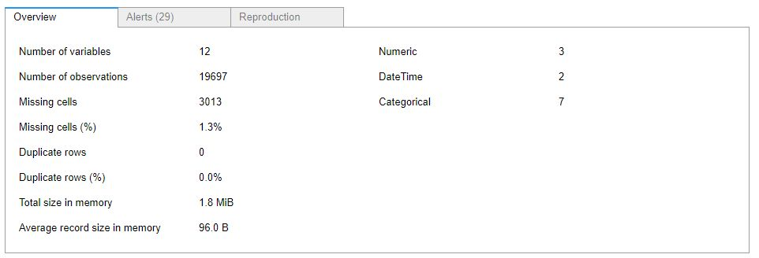
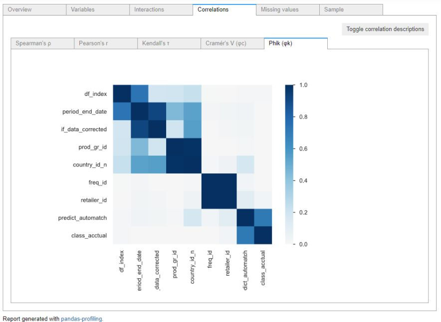
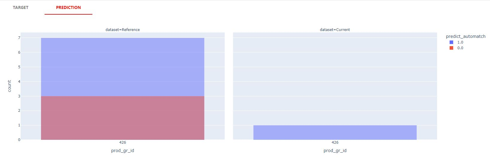
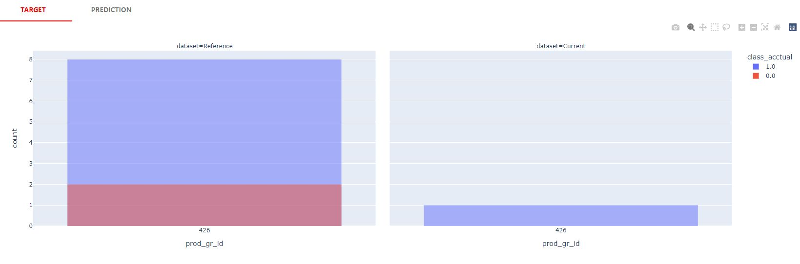
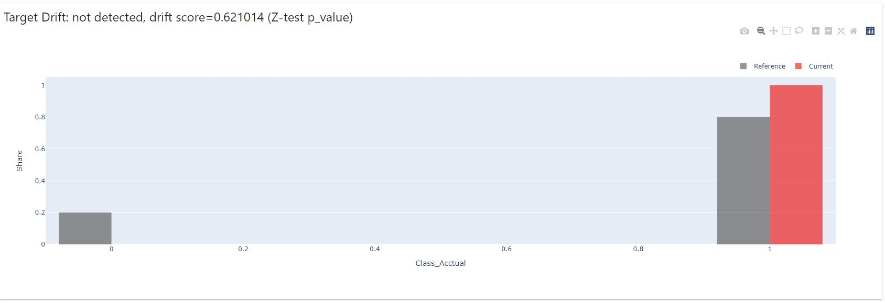
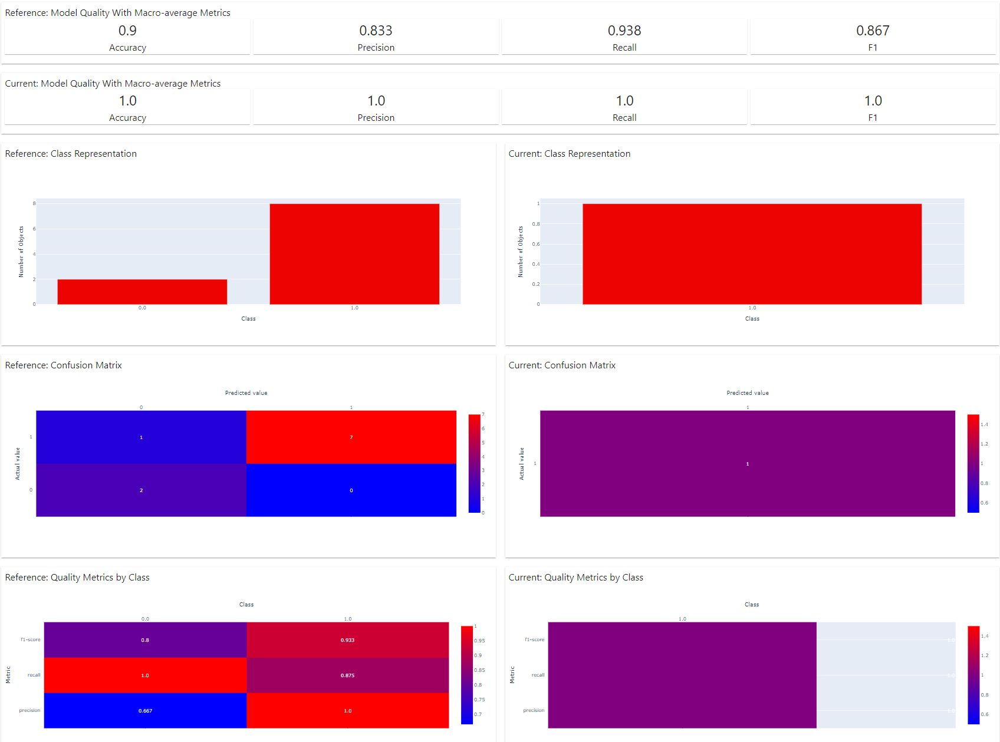

```
Folder PATH listing
├───config
├───docs
│   └───images
│       ├───evidently_ai
│       ├───metrics
│       └───pandas_profiler
├───input
├───logs
├───notebooks
├───output
│   ├───charts
│   │   ├───monthly_stability
│   │   │   ├───class_acctual
│   │   │   │   ├───brand_id
│   │   │   │   ├───country_id_n
│   │   │   │   ├───delivery_type_id
│   │   │   │   ├───prod_gr_id
│   │   │   │   └───retailer_id
│   │   │   └───predict_automatch
│   │   │       ├───brand_id
│   │   │       ├───country_id_n
│   │   │       ├───delivery_type_id
│   │   │       ├───freq_id
│   │   │       ├───if_data_corrected
│   │   │       ├───prod_gr_id
│   │   │       └───retailer_id
│   │   └───weekly_stability
│   │       ├───class_acctual
│   │       │   ├───brand_id
│   │       │   ├───country_id_n
│   │       │   ├───delivery_type_id
│   │       │   ├───prod_gr_id
│   │       │   └───retailer_id
│   │       └───predict_automatch
│   │           ├───brand_id
│   │           ├───country_id_n
│   │           ├───delivery_type_id
│   │           ├───prod_gr_id
│   │           └───retailer_id
│   └───reports
│       ├───classification_performance
│       ├───data_drift
│       └───target_drift
└───scripts
    └───python
```

# Measurement of served model bias - Theory

---

## Challenges and assumptions

**Explainability**
>
> "Explainability should be taken into account during each stage of the ML lifecycle,
> for example, Problem Formation, Dataset Construction, Algorithm Selection,
> Model Training Process, Testing Process, Deployment, and Monitoring/Feedback.
> It is important to have the right tools to do this analysis.
>
> Model explanation tools can help ML modelers and developers and other internal
> stakeholders understand model characteristics as a whole prior to deployment
> and to debug predictions provided by the model once deployed
>
> What is the function of an explanation in the machine learning context?
> An explanation can be thought of as the
> answer to a why-question, thereby helping a human understand the cause of a prediction.
> In the context of a machine
> learning model, we may be interested in answering questions such as
> “Why did the model predict a negative outcome
(e.g., loan rejection) for a given user?”, “How does the model make predictions?”,
> “Why did the model make an
> incorrect prediction?”, and “Which features have the largest influence on the behavior of the model?”
> Thus, explanations can be useful for auditing and meeting regulatory requirements,
> building trust in the model and supporting human decision making, and debugging and improving model performance.
>
> Some customers may care about contrastive explanations, or explanations of why an event X happened
> instead of some other event Y that did not occur. Here, X is the event that happened
> (an unexpected or surprising outcome as discussed above), and Y corresponds to an expectation
> based on their existing mental model. Note that for the same event X,
> different people may seek different explanations depending on their point of view or mental model Y.
> In the context of explainable AI, we can think of X as the example being explained and Y as a “baseline”
> that is typically chosen to represent an uninformative or average example in the dataset."
> #### [SOURCE](https://pages.awscloud.com/rs/112-TZM-766/images/Amazon.AI.Fairness.and.Explainability.Whitepaper.pdf)


**Sources of Bias**

> "As various bias metrics examine different nuances and ways in which bias may arise,
> and there is not a single bias metric applicable across all scenarios,
> it is not always easy to know which ones apply in a particular situation or domain.
> Bias in a model arises in many ways. We provide a sixcategory taxonomy of sources of bias:
>
>
> 1. Biased labels. This arises from human biases and accumulates in datasets.
It is particularly prevalent in public datasets with multiple labelers, like police data,
 public opinion datasets, etc., see Wauthier and Jordan (2011)
>
>
> 2. Biased features, also known as “curation” bias. Here, bias arises from selecting some features and dropping
others and can occur directly or indirectly. For example, in lending,
a modeler may choose features that are more likely to disadvantage one group and leave out features
that would favor that group. While this may be deliberate,
it is also possible to have these be done as part of an unconscious process.
O’Neil (2016) gives a great example where her model for why children love eating their vegetables
was an outcome of culinary curation, where they seem to eat all their vegetables
given no servings of pizza, potatoes, meat, etc.
>
>
> 3. Objective function bias, noted by Menestrel and Wassenhove (2016).
One case in which this occurs is when the loss function may be overly focused on outliers
and if outliers are of specific types in the dataset, the modeler may inject bias.
>
>
> 4. Homogenization bias, where machines generate the data to train later models, perpetuating bias.
In these settings, future outcomes are biased, which create a feedback loop through the models,
making future models, decisions, and data even more biased.
>
>
> 5. Active bias. Here the data is simply made up and results in biases in people’s inferences,
opinions, and decisions. Fake news is the prime example. Such bias may be managed by considering the source,
by reading beyond the headline, checking authorship, running fact checks, verifying dates,
making sure that it is really a fact and not a joke, satire, or comedy.
More importantly, carefully consider expert credentials, and carefully check for confirmation bias.
>
>
>  6. Unanticipated machine decisions. Untrammeled machine-learning often arrives at optimal solutions
that lack context, which cannot be injected into the model objective or constraints.
For example, a ML model that takes in vast amounts of macroeconomic data and aims to minimize
deficits may well come up with unintended solutions like super-normal tariffs leading to trade wars.
This inadmissible solution arises because the solution is not excluded in any of the model constraints.
The model generates untenable answers because it does not have context."
> #### [SOURCE](https://pages.awscloud.com/rs/112-TZM-766/images/Fairness.Measures.for.Machine.Learning.in.Finance.pdf)


> **Pre-Trainng Metrics**

> * Class imbalance (CI)
> * Difference in positive proportions in observed labels (DPL)
> * Kullback and Leibler Divergence (KL)
> * Jensen-Shannon divergence (JS)
> * Lp norm (LP)
> * Total variation distance (TVD)
> * Kolmogorov-Smirnov (KS)
> * Conditional Demographic Disparity in Labels (CDDL)
>
> "Of the eight pre-training bias metrics, the first two
> can detect negative bias, whereas the next five are agnostic
> to which class is advantaged or disadvantaged. The last one
> is positive."
> #### [SOURCE](https://pages.awscloud.com/rs/112-TZM-766/images/Fairness.Measures.for.Machine.Learning.in.Finance.pdf)


**Post-Trainng Metrics**

> * Difference in positive proportions in predicted labels (DPPL)
> * Disparate Impact (DI)
> * Difference in conditional outcomes (DCO)
> * Difference in Conditional Acceptance (DCA):
> * Difference in conditional rejection (DCR)
> * Recall difference (RD)
> * Accuracy Difference (AD)
> * Treatment Equality (TE)
> * Conditional Demographic Disparity of Predicted Labels
    (CDDPL)
> * Counterfactual difference (CD)
> * FlipTest (FT)
> #### [SOURCE](https://pages.awscloud.com/rs/112-TZM-766/images/Fairness.Measures.for.Machine.Learning.in.Finance.pdf)


**Bias Mitigation**

> "Some common corrections that may be applied are
> as follows:
>  1. Removal of the class variable from the feature set.
For example, restricted characteristics such as gender,
race/ethnicity, and age.
>  2. Rebalance the training sample pre-training. This corrects
unfairness from differences in base rates.
>  3. Adjust labels on the training dataset and re-train.
>  4. Adjust cutoffs post-modeling."
> #### [SOURCE](https://pages.awscloud.com/rs/112-TZM-766/images/Fairness.Measures.for.Machine.Learning.in.Finance.pdf)


# Measurement of served model bias - Practice

**Observations and hypotheses about the data set provided (Guessing Game)**

> * The assumption regarding the Business Context of data: retail online data.
> * The assumption regarding Meaning of Label: probably the model tries to predict if a person would be interested in a product. Recommendation tasks.
> * The assumption regarding Sales Channel: email, ad, baner marketing.
> * The assumption regarding provided data: given fields/variables are just model attributes which can be used for exploratory needs.
>   * I am guessing that those fields are not really model inputs used during its training.
> * The assumption regarding Marketing Context: the data provided related to the Black Friday marketing event
>   * Black Fridays took place during the 48th week of 2020 (on the 27th of November 2020).
>     * There is a huge drop in events after the 48th week of 2020.
>     * Most likely the promotions for product groups ended.
>     * Seems like the context of Black Friday promotions got old (as can happen with Halloween or Christmas related marketing scenarios).
>     * Since the model was most probably built on the larger sample - with many, many more classes involved per each variable -
        the drop in events had an impact on the overall performance of served model

> * Provided sample of data is related only to three groups of products: [426, 413, 427]
> 
> * Product groups have been supplied by multiple retailers: 52
> 
> * Suppliers could have originated from multiple countries: 121
> 
> * Many different brands could have been recommended to the recipients of the e-mails (high cardinality): 199
> 

> For the sake of Introduction completeness, I am showing below the total counts of categories for both predicted 
> [predict_automatch] and observed [class_acctual] events.
> 
> 

> The tab 'Overview' of Pandas Data Profiler gives us general feedback on the quality of provided data sample.
> 

> Alerts related to the Integrity of Data are also provided:
> 
> High cardinality of [retailer_id] and [brand_id] might encourage to ask if the model served is prone to the phenomenon of 'data leakage' 

> The correlation matrix indicates a strong correlation between [prod_gr_id] and [country_id_n]. Seems like product
> groups have a geographical notion, including differences in customer preferences.
> 

> From a quick look into the Interactions tab, we can loosely assume that served model was developed with a thought to
> favour more TP over TN.
> 

> Other business-related characteristics of the data set are so far unknown.


**Reports**

> Python open source library called 'Evidently AI' was used to produce three types of reports, namely:
> * Target Drift
> * Data Drift
> * Classification Performance
>
> Next, using mentioned reports I will try to provide some assumptions about served model.

**Target Drift and Prediction Drift**

> First, I will focus a bit on the analysis of Target Drift, and related Prediction Drift.
> The below graphs are showing a global (high level) perspective on the matter of Target Drift and Prediction Drift.
> The graphs are here to help answer the question if the hard cutoff on the 28th of November was somehow the right choice
> to assume. The cutoff sliced the data set into 13 weekly buckets of the so-called 'Reference' data set and 12 weekly
> buckets
> of the so-called 'Current' data set.
>

#### Predicted events bucketed by week_number


#### Observed events bucketed by week_number


> From bucketed quantities of the above graphs, we can loosely assume that the hypotesis about the drop in the size
> of supplied events related to Black Friday might be True.
> Hence the drop in under-performance of the served model. The topic being predicted got "out of fashion".
> Quite a similar story can happen with Christmas-related products.

>
> Now let's look quickly at similar graphs but related to quantities of product groups being under (presumably) Black
> Fridays promotions.
>
#### Predicted events bucketed by prod_gr_id


#### Observed events bucketed by prod_gr_id


> My guess is that some retailers (probably) extended their e-mail communications due to their stock not being sold
> completely.
> 
> Having broad (high level) assumptions about the data set let's move now to assess if there is any Target
> Drift - statistically speaking. Jensen-Shannon distance is used as a tool for judging if the distributions between so
> called Reference (13 weeks of data) and Current (12 weeks of data) samples are meaningfully different.
> The below chart exhibits no indication for Target Drift when the data set got sliced into two parts with use of a cutoff
> on
> 28th of November 2020. At first, that is indeed a bit surprising regarding the drop in events. The reason for the lack
> of
> alert related to the Target Drift might be related to ratios between Zeros and Ones of both periods.
> Although it is true that from Counts perspective we have experienced a huge drop in events, the ratios from Current
> period were still similar to the ratios of Zeros and Ones from the Reference period.
> We got here quite a nice ' real-world' example of not jumping to conclusions based on a single source of information.
> Unfortunately, we have to dig further into data if we want to confirm with a larger dose of certainty that the model
> should have been put offline right after the 27th of November 2020. From now on that will be my goal here.

#### Basing on Jensen-Shannon distance Target Drift and Prediction Drift have not been detected between Current and Reference samples sliced on 28th of November 2020. 


> For the sake of simplicity of further analysis over the deterioration of served model I am defining three possible
> combinations of
> Reference and Current data samples:
> * week_number == 202038 vs week_number == 202039
> * week_number == 202048 vs week_number == 202049
> * week_number == 202101 vs week_number == 202102


---

#### Target Drift and Prediction Drift
#### week_number == 202038 vs week_number == 202039


#### Predicted events bucketed by prod_gr_id


#### Observed events bucketed by prod_gr_id


> Here for week_number == 202038 vs week_number == 202039 we can already observe some different quantities in product
> groups being more likely recommended:

#### Predicted events bucketed by prod_gr_id


#### Observed events bucketed by prod_gr_id


> Predictions for country_id_n == 128 are missing:

#### Predicted events bucketed by country_id_n


#### Observed events bucketed by country_id_n


> Again, no Target Drift and no Prediction Drift for week_number == 202038 vs week_number == 202039, basing on
> Jensen-Shannon distance:


---

#### Target Drift and Prediction Drift
#### week_number == 202048 vs week_number == 202049

> Huge drop of predicted events after Black Friday:

#### Predicted events bucketed by prod_gr_id


#### Observed events bucketed by prod_gr_id


> Huge drop of predicted events after Black Friday:

#### Predicted events bucketed by prod_gr_id


#### Observed events bucketed by prod_gr_id


> Huge drop of predicted events after Black Friday:

#### Predicted events bucketed by country_id_n


#### Observed events bucketed by country_id_n


> Again, no Target Drift and no Prediction Drift for week_number == 202048 vs week_number == 202049, basing on
> Jensen-Shannon distance:


---

#### Target Drift and Prediction Drift
#### week_number == 202104 vs week_number == 202105

> In general, although the model seemed to work fine, there was only one meaningful
> event during the whole week of 202105. The event turned out to be a TP. In my opinion, this is the point in time when we
> can tell from an Operations point of view that the model became obsolete. Black Friday ended around two months earlier.
> I have no comments on TP, FP, TN or FN. in my opinion model worked fine until Black Friday happen.

#### Predicted events bucketed by prod_gr_id


#### Observed events bucketed by prod_gr_id


> Only one event for week 202105. The event turned out to be a TP:

#### Predicted events bucketed by prod_gr_id



#### Observed events bucketed by prod_gr_id



> Only one meaningful event for week 202105. The event turned out to be a TP:

#### Predicted events bucketed by country_id_n


#### Observed events bucketed by country_id_n


> Again, no Target Drift and no Prediction Drift for week_number == 202104 vs week_number == 202105.
> Due to a huge drop in events, Z-test was used.:




---

#### Data Drift
#### Global
> If we use the 28th of November as the cutoff, the Data Drift report tries to inform us about indications of drifts. 
> Since we are looking here at attributes (not real features/inputs used during training) of the trained/served model, we can only use them for data exploration purposes.


---

#### Data Drift
#### week_number == 202038 vs week_number == 202039
> Predicted and Observed distributions are not indicating data drift between week 202038 and week 202039.
> 
> [prod_gr_id] does not exhibit data drift between week 202038 and week 202039.


---

#### Data Drift
#### week_number == 202048 vs week_number == 202049
> Predicted and Observed distributions are not indicating data drift between week 202048 and week 202049
> 48 week was the week of Black Friday. This time any indications of drift should be considered and analysed further.


---

#### Data Drift
#### week_number == 202104 vs week_number == 202105
> Counts and related distributions went down. Time to put the model offline.


---


#### Classification Performance
#### Global
> General characteristics for model performance when we use the hard cutoff on the 28th of November to slice the data in half are more than decent.
> Due to business requirements, the model favours more TP rather than TN. What can be clearly seen by the high level of Recall and F1-Score.
> Moreover, Recall and F1-Score are quite similar between Reference and Current samples. What indicates a stable model.
> The model seems to be all healthy and happy.


---

#### Classification Performance
#### week_number == 202038 vs week_number == 202039

> Recall and F1-Score for week 202039 increased in a relation to week 202038. That might have been related to an increase in events.
> There was a rising trend in the number of events per week before Black Friday happened. A more accurate assessment needs further analysis.
> The model seems to be all healthy and happy.


---

#### Classification Performance
#### week_number == 202048 vs week_number == 202049
> Interestingly, a drop in events for week 202049 increased Recall and F1-Score. What might be counterintuitive at first.
> It seems like any case of too large increase or too large drop for either Recall or F1-Score should be monitored by automated processes.
> Vigilance is advised.


---

#### Classification Performance
#### week_number == 202104 vs week_number == 202105
> Due to the drop in events, Recall and F1-Score increased even more. Definitely, it is time to put the model offline.



---

#### Selected weekly stability charts by attributes classess

> Assuming the need for monitoring weekly stability of served model (also due to weekly seasonality of the data) across
> its attributes (descriptive features) we can take a quick look at weekly stability charts of [brand_id]:

#### Predicted events bucketed by week_number for [brand_id] == 77


#### Observed events bucketed by week_number for [brand_id] == 77


#### Predicted events bucketed by week_number for [brand_id] == 82


#### Observed events bucketed by week_number for [brand_id] == 82


> * With those kinds of charts, we can try to get more insides into FP and FN.
> * Some brands (id == 77) were still recommended even though Black Friday was over. from a current perspective we can
    consider those products as being less successful during Black Friday and some weeks before.
> * Although the performance of the model in my opinion was totally fine, maybe "dimensionality reduction" technics
    would improve the generalization capabilities of the analysed classifier, e. g. "Weight of Evidence".

---
> # SUMMARY
> 
> In my opinion developed binary classifier served right it's purpose.
> From the perspective of general metrics like Recall or F1-Score the model was acting all healthy while reasonably amount of feed was provided.
> The model started to deteriorate right after Black Friday 2020.
> It was right decision to put it offline at the beggining of 2021.

---
> # TODO:
> #### Will try to assess model attributes with the use of post-training metrics described below.
----

> ### Outputs of bucketed Post-training metrics
> #### A view on general stability of attributes classes regardless of point in time.
> Link to the notebook with computations:
> 
> [post_training_metrics.ipynb](post_training_metrics.ipynb)
> 
> ---
> #### Difference in positive proportion in predicted labels (DPPL)
>
> [DPPL bucketed output](output/DPPL_bucketed.txt)
> #### Conclusions:
TODO:
> ---
> #### Disparate (Adverse) Impact (DI)
>
> [DI bucketed output](output/DI_bucketed.txt)
> #### Conclusions:
TODO:
> ---
> #### Difference in Conditional Outcome (DCO)
> Difference in Conditional Acceptance (DCA)
>
>
> [DCA bucketed output](output/DCA_bucketed.txt)
> #### Conclusions:
> TODO:
> #### Difference in Conditional Rejection (DCR)
> 
> 
> [DCR bucketed output](output/DCR_bucketed.txt)
> #### Conclusions:
> TODO:
> 
> #### Recall Difference (RD)
> 
>
> [RD bucketed output](output/RD_bucketed.txt)
> #### Conclusions:
> TODO:
> #### Difference in label rates (DLR)
> 
>
> [DAR bucketed output](output/DAR_bucketed.txt)
> #### Conclusions:
> TODO:
> [DRR bucketed output](output/DRR_bucketed.txt)
> #### Conclusions:
> TODO:
> #### Accuracy DIfference (AD)
> 
> 
> [AD bucketed output](output/AD_bucketed.txt)
> #### Conclusions:
> TODO:


#### SOURCES:
[Fairness Measures for Machine Learning in Finance](https://pages.awscloud.com/rs/112-TZM-766/images/Fairness.Measures.for.Machine.Learning.in.Finance.pdf)

[Evidently AI](https://docs.evidentlyai.com/)

[Pandas Profiling](https://pandas-profiling.ydata.ai/docs/master/index.html)

[Jensen-Shannon distance](https://docs.scipy.org/doc/scipy/reference/generated/scipy.spatial.distance.jensenshannon.html)

[Weight of Evidence](https://www.analyticsvidhya.com/blog/2021/06/understand-weight-of-evidence-and-information-value/)